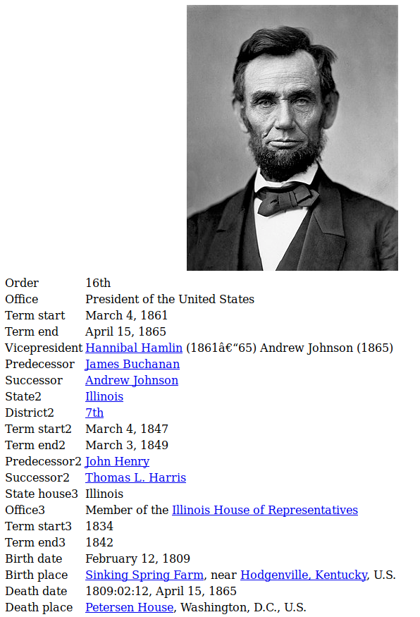

# Extracting the place of birth for American presidents

In this advanced tutorial, we will build a `Fonduer` application to tackle the
task of extracting the place of of birth for American presidents from their 
wikipedia html pages. This is an example of knowledge base construction from 
_richly formatted data_. 

The entire tutorial can be found in
[`president_place_of_birth_tutorial.ipynb`](president_place_of_birth_tutorial.ipynb). Before
running the tutorial you will need to:
  1. Run `./download_data.sh` to get the data used in the tutorial.
  2. Create a postgres database named `pob_presidents`. Assuming you have postgres
     installed, you can simply run `createdb pob_presidents`.


## Example

For example, the simplified datasheet snippet:



Our goal is to extract the (President name, Place of birth) relation pairs:

```
("Abraham Lincoln", "Sinking Spring Farm")
```
